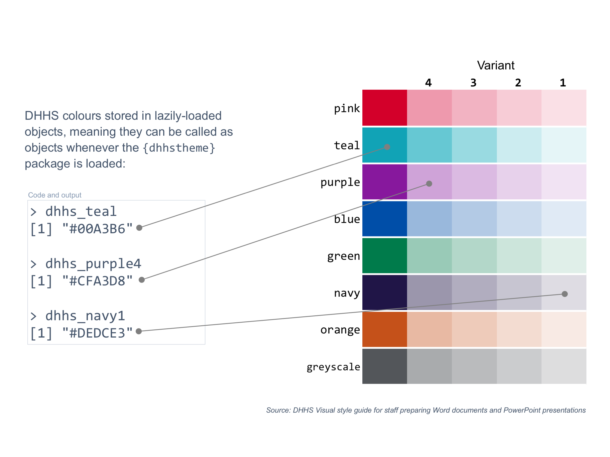
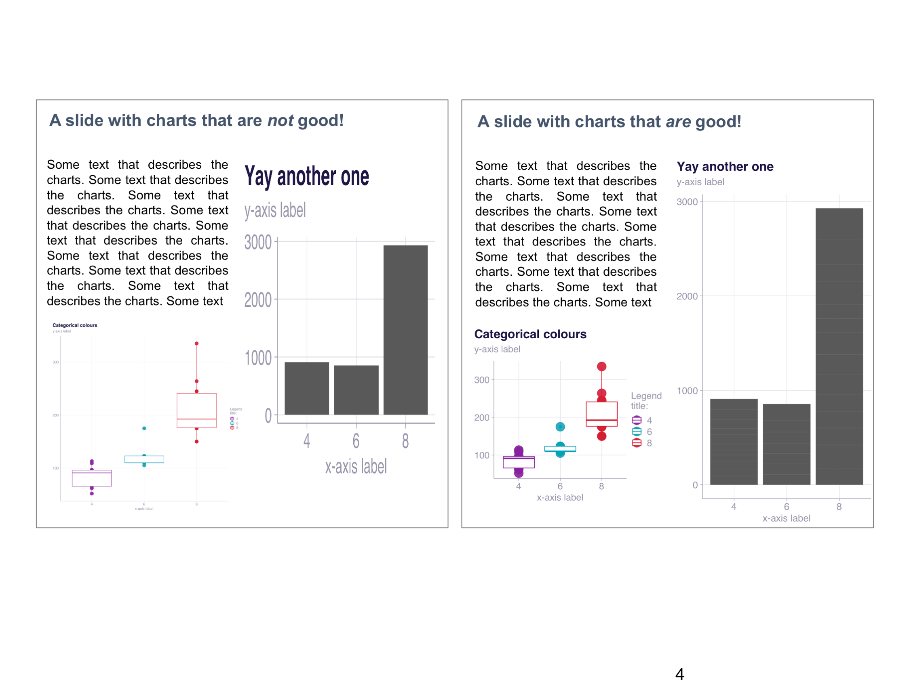
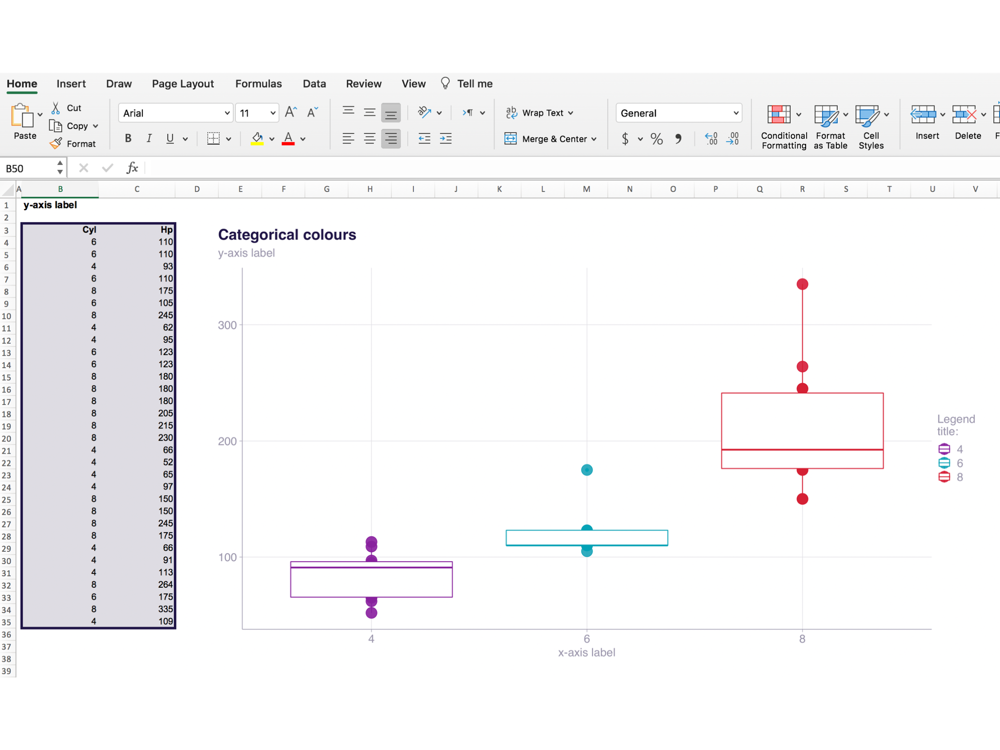
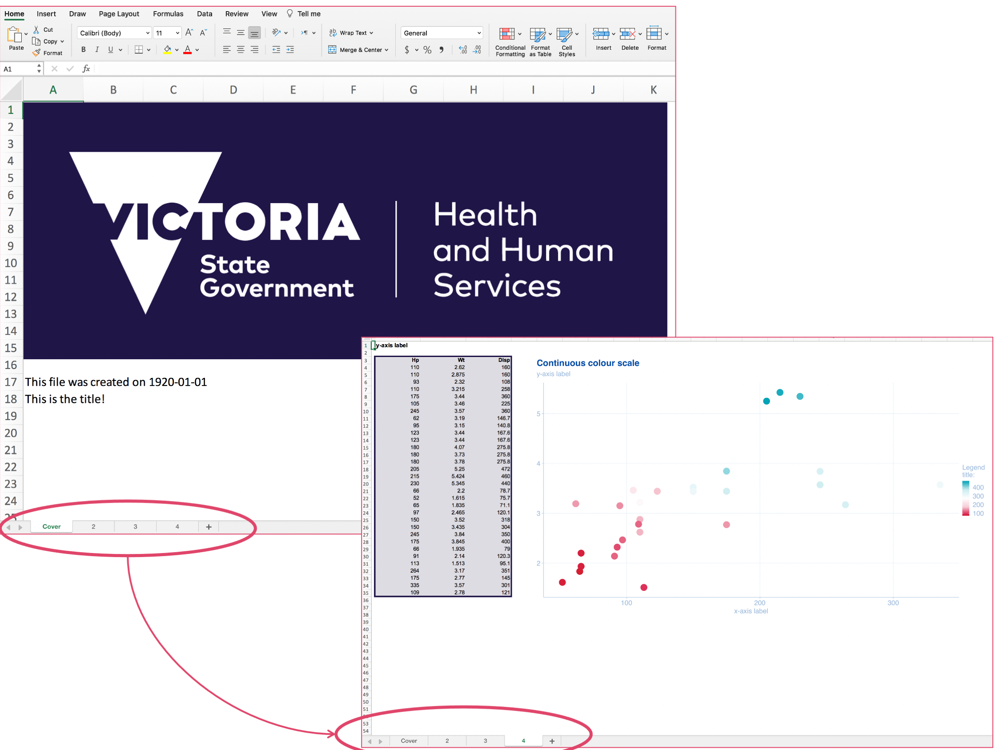

<!-- README.md is generated from README.Rmd. Please edit that file -->

```{r, include = FALSE}
knitr::opts_chunk$set(
  collapse = TRUE,
  comment = "#>",
  fig.path = "man/figures/README-",
  fig.align = "left",
  out.width = "75%"
)

devtools::load_all()
library(tidyverse)

```

# dhhstheme

<!-- badges: start -->
<!-- badges: end -->

**This package is under development and subject to change substantially.** 
Use for exploration but not yet for production. 

This package is designed to make DHHS-styled charts with the `ggplot2` R package.

Please file an issue to report bugs or request features at [wfmackey/dhhstheme/issues](https://github.com/wfmackey/dhhstheme/issues).


The package is currently maintained by Will Mackey, Jonathan Nolan and Callum Shaw. 
It is based on and steals a lot of code from [`grattantheme`](https://github.com/grattan/grattantheme) created by Matt Cowgill and Will Mackey.


# The `dhhstheme` package

The `dhhstheme` package is designed to make it easier to generate DHHS-style charts using the `ggplot2` package in R.


It has **four key features**:

- **Theme**: provides a flexible {ggplot} theme to make consistent-looking charts
- **Colour**: provides each colour in the DHHS palette and tools to use them
- **Export plots**: tools to export plots for commonly-used DHHS slides
- **Export plot data**: tools to export nicely-formatted data alongside plots

These features are demonstrated below.


# Installation and set up

The package is hosted on Github. To install a package from Github, use the `install_github()` function from the `remotes` package:

```{r install, eval=FALSE}
install.packages("remotes")
remotes::install_github("wfmackey/dhhstheme")
```

Then load the package, along with the `tidyverse` package that contains `ggplot2` and other data-manipulation tools:

```{r library, message = FALSE, warnings = FALSE,eval=FALSE}
library(dhhstheme)
library(tidyverse)
```

The package contains some COVID-19 data from [Our World in Data](https://ourworldindata.org/coronavirus) for demonstrations. This is  loaded with the package in `owid_sample`: 


```{r data}
glimpse(owid_sample)
```


# Theme

`dhhs_theme` provides a consistent look and feel for DHHS charts.
The default looks like this:


While some elements -- like the base colour, minor gridlines and panel borders -- are adjustable from within the `dhhs_theme`, the theme maintains a consistent look:


## Making a basic bar chart using `theme_dhhs`

```{r base_col}
owid_sample %>% 
  filter(country == "Australia") %>% 
  ggplot(aes(date, new_cases)) + 
  geom_col(width = 1)
```


To add the DHHS theme, add `theme_dhhs`:

```{r theme_col}
owid_sample %>% 
  filter(country == "Australia") %>% 
  ggplot(aes(date, new_cases)) + 
  geom_col(width = 1) +
  theme_dhhs()
```


You can use the pre-set DHHS colours (see next section) to `fill` the plot, and add a DHHS y-axis:

```{r theme_col2}
owid_sample %>% 
  filter(country == "Australia") %>% 
  ggplot(aes(date, new_cases)) + 
  geom_col(width = 1,
           fill = dhhs_navy) +
  theme_dhhs() + 
  dhhs_y_continuous()
```


Finally, adding titles and labels:

```{r theme_col3}
aus_cases <- owid_sample %>% 
  filter(country == "Australia") %>% 
  ggplot(aes(date, new_cases)) + 
  geom_col(width = 1,
           fill = dhhs_navy) +
  theme_dhhs() +
  dhhs_y_continuous() +
  labs(title = "Australia's second wave",
       subtitle = "Daily COVID-19 cases in Australia",
       x = NULL,
       y = NULL,
       caption = "Source: Our World in Data (ourworldindata.org/coronavirus).")

aus_cases
```


# Colours

`dhhstheme` comes with lazily-loaded DHHS hex values.
After `dhhstheme` has been loaded with `library(dhhstheme)`, use a colour by typing `dhhs_` and the colour name. E.g.:

```{r colour-demo}
dhhs_pink
dhhs_navy
dhhs_blue
dhhs_blue1
```


The colours are sourced from the _DHHS Visual style guide for staff preparing Word documents and Powerpoint presentations_. They are:



Two helper functions are provided to assist in selecting a colour palette for your chart: `dhhs_colour_continuous()` and `dhhs_fill_continuous()`. These can be used to assign colour or fill `geoms` to a DHHS palette:

```{r dhhs_colour1}
owid_sample %>% 
  filter(start_of_month,
         country %in% c("United States",
                        "Sweden",
                        "France")) %>% 
  ggplot(aes(total_cases_per_million, total_deaths_per_million,
             colour = country)) + 
  geom_point(size = 4) + 
  theme_dhhs(legend = "top") +
  dhhs_y_continuous() +
  dhhs_x_continuous(labels = scales::comma) + 
  dhhs_colour_manual(4) +
  labs(title = "More COVID-19 cases have led to more deaths",
       subtitle = "COVID-19 deaths per million population",
       x = "COVID-19 cases per million population",
       y = NULL,
       colour = NULL,
       caption = "Source: Our World in Data (ourworldindata.org/coronavirus).")
```

Alternatively, you can provide your own colour combinations using a `value` argument:

```{r dhhs_colour2}
owid_plot <- owid_sample %>% 
  filter(start_of_month,
         country %in% c("United States",
                        "Sweden",
                        "France")) %>% 
  ggplot(aes(total_cases_per_million, total_deaths_per_million,
             colour = country)) + 
  geom_point(size = 4) + 
  theme_dhhs(legend = "top", panel_borders = "border") +
  dhhs_y_continuous() +
  dhhs_x_continuous(labels = scales::comma) + 
  dhhs_colour_manual(values = c(dhhs_pink4, dhhs_green4, dhhs_blue4, dhhs_purple4)) +
  labs(title = "More COVID-19 cases have led to more deaths",
       subtitle = "COVID-19 deaths per million population",
       x = "COVID-19 cases per million population",
       y = NULL,
       colour = NULL,
       caption = "Source: Our World in Data (ourworldindata.org/coronavirus).")

owid_plot
```


## Saving a chart

The `dhhs_save` function is a wrapper around `ggsave` with pre-set sizes and features commonly used in exporting charts at DHHS.

```{r save_col}
dhhs_save("data-raw/owid_plot.png", 
          plot_object = owid_plot)
```

This is designed to reduce ugly post-production re-sizing:




By default, this will save a 'whole' sized plot, which will fit the whole **plotting** area of a DHHS Powerpoint slide. Often we will want plots that cover half or a third of a slide, or to just cover the top or bottom. 
We can use the `type` argument and one of nine pre-set sizes:

- `"whole"`: The default. Use for a plot covering the whole body of a DHHS slide.
- `"half"`: Use for a tall plot covering the full left or right side a normal DHHS slide.
- `"third"`: Use for a tall plot covering roughly one-third of the horizontal space on a DHHS slide.
- `"short-whole"`: Use for a short plot covering half the body of a
DHHS slide. 
- `"short-half"`: Use for a short plot covering half of the left or right side of a DHHS slide. 
- `"short-third"`: Use for a short plot covering roughly one-third of the horizontal space on a normal DHHS slide. 
- `"all"`: Export all of the above in a folder called `file_path`. 

For example: 

```{r save_col_half}
dhhs_save("data-raw/owid_plot.png", 
          plot_object = owid_plot,
          type = "half")
```

Choosing 'all' will create a folder called `file_path` (sans extension) and populate it with all possible chart types:

```{r save_col_short-third}
dhhs_save("data-raw/owid_plot.png", 
          plot_object = owid_plot,
          type = "all")
```


Additionally, because there are three commonly-used templates with different sizes, you can tell `dhhs_save` the template you are using with `ppt_size`. This takes one of three options:

- `"large"`: for large Powerpoints with height 26.67 and width 35.56cm. 
- `"normal43`: for standard 4:3 Powerpoints with height 19.05 and width 25.4cm.
- `"normal169"`: for wide standard 16:9 Powerpoints with height 19.05 and width 33.87cm.


These are applied alongside the `type` argument. For example, to save a plot that takes up half the plotting area on the standard 16:9 DHHS template: 

```{r save_ppt_size}
dhhs_save("data-raw/owid_plot.png", 
          plot_object = owid_plot,
          type = "half",
          ppt_size = "normal169")
```


# Exporting chart data

The `dhhs_save` function can create an Excel file that contains your plot and the data used to make it. This can be called using the `export_chartdata` argument: 

```{r save_chart_data}
dhhs_save("data-raw/owid_plot.png", 
          plot_object = owid_plot,
          export_chartdata = TRUE)
```

By default, this will export _only_ the variables that are used in the chart.
To add additional variables, use the `add_vars` argument: 

```{r save_chart_data_add_vars}
dhhs_save("data-raw/owid_plot.png", 
          plot_object = owid_plot,
          export_chartdata = TRUE, 
          add_vars = "date")
```

Which creates an Excel file with the variables `total_cases_per_million`, `total_deaths_per_million`, `country` and `date`:




# Exporting the data of multiple charts

The `save_chartdata` function, which is called by `dhhs_theme` when exporting the Excel file, can be called directly. If you provide it with a list of plots, it will create a single Excel file with a cover page and one sheet per plot. For example:

```{r}
save_chartdata("data-raw/owid_plot.xlsx", 
               object = list(owid_plot, aus_cases))
```

creates an Excel file with a cover page, adds a sheet for `owid_plot`, then another for `aus_cases`: 



