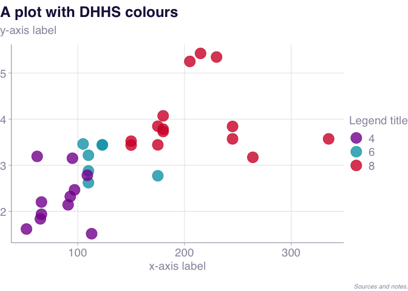

<!-- README.md is generated from README.Rmd. Please edit that file -->

# dhhstheme

<!-- badges: start -->

<!-- badges: end -->

*This package is under development and subject to change substantially.*
Use for exploration but not yet for production.

This package is designed to make DHHS-styled charts with the `ggplot2` R
package.

It is currently maintained by Will Mackey.

Please file an issue to report bugs or request features at:

## Installation

You can install this package from [GitHub](https://github.com/) with:

``` r
# install.packages("devtools")
devtools::install_github("wfmackey/dhhstheme")
```

## Example

``` r
library(dhhstheme)
library(tidyverse)
#> ── Attaching packages ────────────────────────────────── tidyverse 1.3.0.9000 ──
#> ✓ ggplot2 3.3.2     ✓ purrr   0.3.4
#> ✓ tibble  3.0.4     ✓ dplyr   1.0.2
#> ✓ tidyr   1.1.0     ✓ stringr 1.4.0
#> ✓ readr   1.3.1     ✓ forcats 0.5.0
#> Warning: package 'dplyr' was built under R version 4.0.2
#> ── Conflicts ────────────────────────────────────────── tidyverse_conflicts() ──
#> x dplyr::filter() masks stats::filter()
#> x dplyr::lag()    masks stats::lag()

mtcars %>%
  ggplot(aes(hp, wt,
             colour = factor(cyl))) +
  geom_point(size = 6, alpha = .8) +
  theme_dhhs() +
  dhhs_colour_manual(3) +
  labs(title = "A plot with DHHS colours",
       subtitle = "y-axis label",
       y = NULL,
       x = "x-axis label",
       colour = "Legend title",
       caption = "Sources and notes.")
```



``` r

dhhs_save("data-raw/ouput/colours.png", type = "half")
#>  - saving data-raw/ouput/colours.png
```
